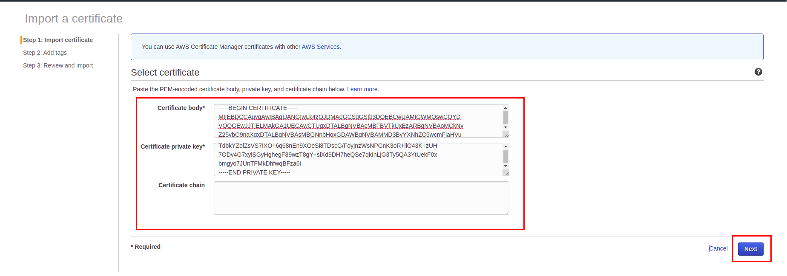
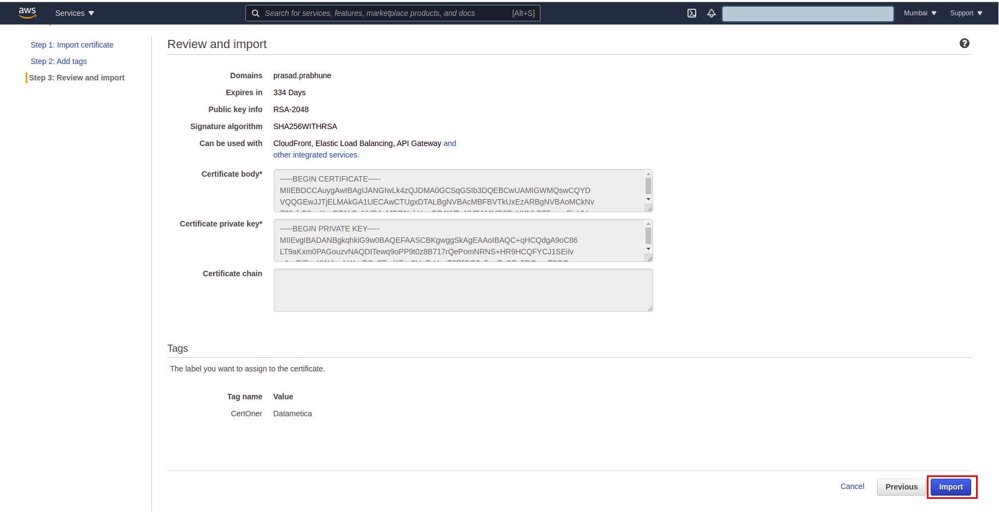
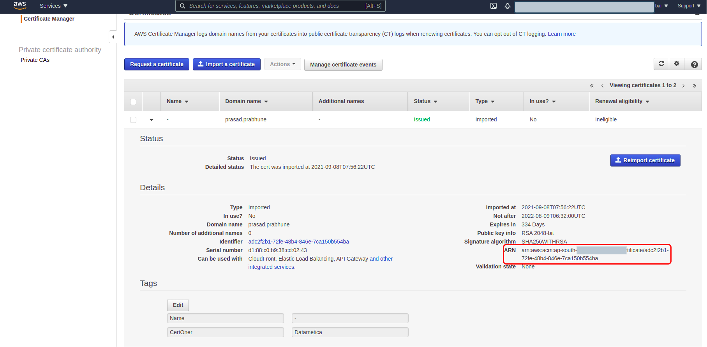

# Steps to import existing wildcard domain certificate to AWS Certificate Manager service
This document serve to explain steps involved in accessing pelican web service through https enabled load balancer URL. 
Before running the helms charts one should import the certificates to AWS certificate manager service and keep handy the ARN that gets created after the successful import. 

You have to provide this ARN value to pelican helm chart deploy command

**Please note: use the same region in which your EKS is deployed for pelican. The ACM does not work across region**

## Certificate import steps
### Requirement
- A valid certificate chain files (crt, key and chain file) [certificate chain is optional]
- A valid domain name respective to the certs 

## Steps (follow the red marked sections from attached screenshots)
1. Login to AWS console and select cert manager service
**ref screenshot** 

2. Click on **import a certificate** button

3. Copy and paste the content from each respective certificate in the text boxes and click on Next botton

4. Add tags if neccessary (optional) and click on "Review and import" button

5. Validate all the information and if in case of inconnect click "Previous" button. If all information is as per expected click on "Import" button

6. Keep the ARN information handly for further deployment of pelican through helm charts


You can use AWS CLI also instead of console to perform the same, following is the example
Replace the files with the absolute path of your certifcate files on system and region to which your EKS is deployed or planning to deploy the pelican
```
$ aws acm import-certificate --certificate <fileb://cert.crt>  --private-key <fileb://cert.key> --certificate-chain <fileb://chain.crt> --region <region-id>

Sample output:
{
    "CertificateArn": "arn:aws:acm:us-west-2:xxxx:certificate/6bc4c27d-7ea7-4b5a-a4e5-c0d93d2eefe1"
}
```
